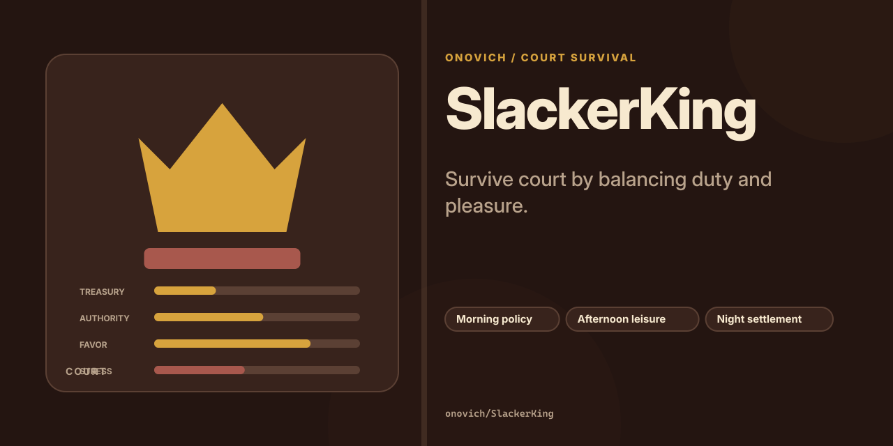

# SlackerKing

[English](README.md)

在理政、享乐和夜间结算间平衡国库、权威、军力、民心与压力的宫廷生存游戏。



**[在线体验](https://onovich.github.io/SlackerKing/)**

## 项目包含什么

- 早晨处理政务。
- 下午选择享乐。
- 夜间统一结算。

## 快速开始

安装依赖并启动本地版本：

```bash
npm install
npm run dev
```

仓库还提供 `npm run build`。

## 仓库结构

- `src/` — 应用与库的源代码。
- `docs/` — 项目文档与设计说明。
- `origin/` — 原始原型与设计资料。
- `.github` — 自动化与 GitHub Pages 工作流。
- `index.html` — Web 入口。

## 文档

- [`docs/PHASE_1_READABILITY_SPEC.md`](docs/PHASE_1_READABILITY_SPEC.md)
- [`docs/PHASE_2_NUMERIC_SPEC.md`](docs/PHASE_2_NUMERIC_SPEC.md)
- [`docs/PHASE_3_FACTION_SPEC.md`](docs/PHASE_3_FACTION_SPEC.md)
- [`origin/design.md`](origin/design.md)
- [`docs/CONTENT_ATLAS.md`](docs/CONTENT_ATLAS.md)

## 当前状态

仓库已经包含与上述用途对应的实现和项目材料。仓库内包含自动化测试；具体兼容性仍取决于目标运行时、编辑器或平台。

## 许可证

当前仓库未包含开源许可证。
